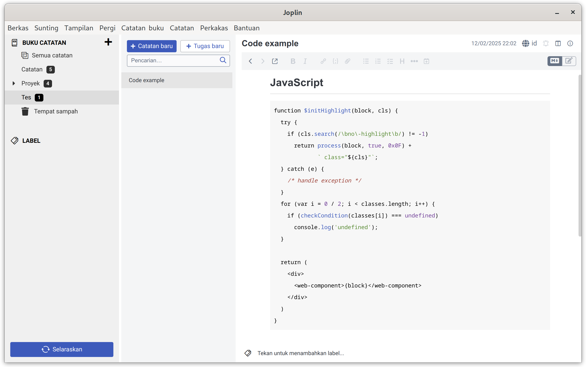

# Alabaster Joplin Theme

## Requirements

Use **only** `Light` theme.

Here's how to set up:

1. Open **Configuration** screen and go to **General > Appearance**.
2. Set Theme to **Light** and uncheck **Automatically switch theme to match system theme**.
3. Click **Apply** to save changes.

## Installation

1. Put `userstyle.css` and `userchrome.css` to `~/.config/joplin-desktop` folder.
2. Restart Joplin to apply theme. Make sure Joplin is exiting, not closing to the tray.

## Alternative installation

1. Open **Configuration** screen and go to **General > Appearance**.
2. Toggle **Show Advanced Settings**.
3. Click **Custom stylesheet for rendered Markdown** and paste `userstyle.css` content. Save changes and close the editor.
4. Click **Custom stylesheet for Joplin-wide app styles** and paste `userchrome.css` content. Save changes and close the editor.
5. Restart Joplin to apply theme. Make sure Joplin is exiting, not closing to the tray.

If you need visual guidance, check the [How to personalise - Joplin on YouTube](https://www.youtube.com/watch?v=DX_BkGuQTC0).

## Troubleshooting

### Can't find configuration folder

The `/.config/joplin-desktop` path might be different for each operating system. Check at the top of **General** page on Configuration screen to find this folder.

## References

- [Configuration screen - Joplin Help](https://joplinapp.org/help/apps/config_screen)
- [Custom CSS - Joplin Help](https://joplinapp.org/help/apps/custom_css)
- [How to personalise - Joplin](https://www.youtube.com/watch?v=DX_BkGuQTC0)
